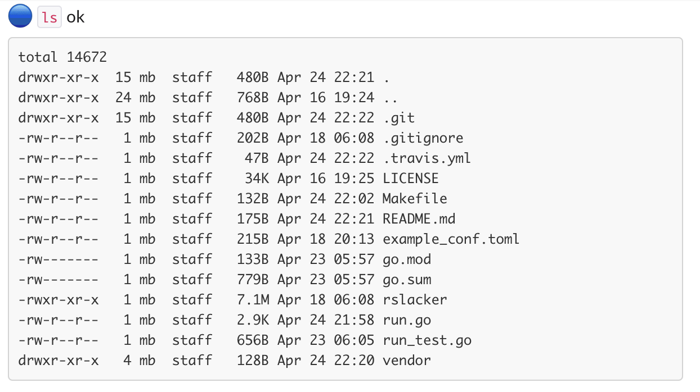
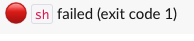

[](https://travis-ci.org/Ragnaroek/run-slacker)
[](https://codecov.io/gh/Ragnaroek/run-slacker)


# run-slacker
runs a program, slacks the result

## Configuration

run-slacker can be configured with a toml file:

```toml
dir = "/working/dir"
prog = "ls"
args = ["-alh"]

[slack]
hook = "https://hooks.slack.com/services/your/slackurl"
```

It slacks you the output and small hint if the command failed or succeeded. This example shows a successfull run:


A failed run, provoked with following configuration as an example,
looks like this:

```toml
dir = "/working/dir"
prog = "sh"
args = ["-c", "exit 1"]

[slack]
hook = "https://hooks.slack.com/services/your/slackurl"
```


That's basically it. Look at the `example_conf.toml` file in the repository root for some more options.

You start the run-slacker like this:
```
rslacker --config=path/to/config.toml
```

To check the configuration add the `--dry-run` option
```
rslacker --config=path/to/config.toml --dry-run
```
It doesn't slack anything and just prints the configuration it uses.
